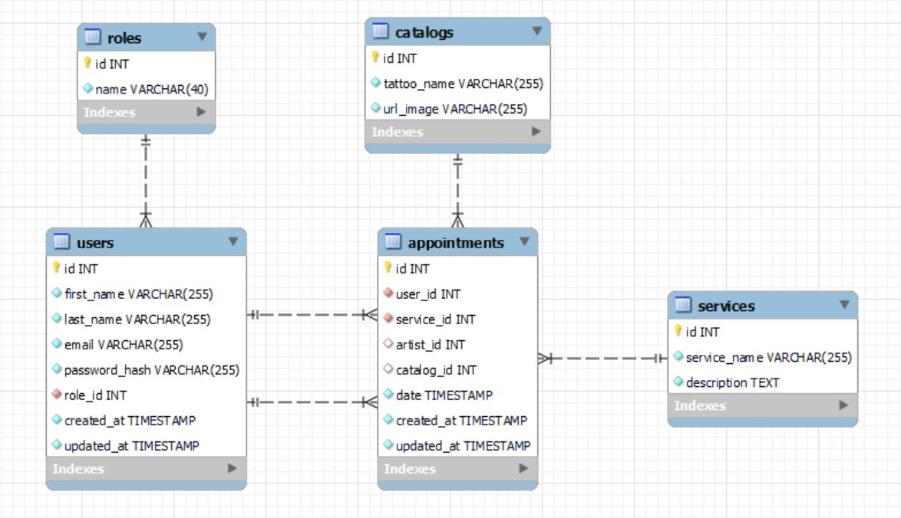
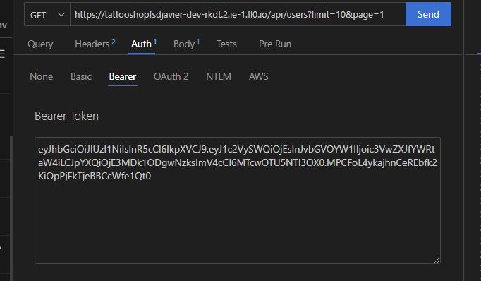

# Welcome to my Tattoo Shop backend app
This is the fourth project in the Full Stack Developer Bootcamp at GeeksHubs

<details>
  <summary>Content 📝</summary>
  <ol>
    <li><a href="#goal">Goal</a></li>
    <li><a href="#about-the-project">About the project</a></li>
    <li><a href="#deploy-🚀">Deploy</a></li>
    <li><a href="#stack">Stack</a></li>
    <li><a href="#db-diagram">DB diagram</a></li>
    <li><a href="#local-installation">Installation</a></li>
    <li><a href="#endpoints">Endpoints</a></li>
    <li><a href="#future-features">Future features</a></li>
    <li><a href="#desarrollo">Development</a></li>
    <li><a href="#contact">Contact</a></li>
  </ol>
</details>

## Goal
This project requires a functional API connected to a MySQL database.

## About the project
I decided to create an app web for the appointment managemet of a tattoo studio.

This studio has different services and the users can make appointments to which service they want.

In case the service is a tattoo (there are another services like piercings) they can choose between the tattoo artists that work in the shop and, in case they want a design that the shop has in its catalog, they can select it.

The super admin role can create new services, add images to the catalog, add new tatoo artists and change roles to users if needed.    

Users can make, see and update their own appointments, they can also see and update their profiles.

All people, without a login, can see the services and the catalog of the shop.

Tattoo artists can see what appointments have scheduled.

I could not erase fields that are already written. If we update an appointment of a service that has tattoo artist and a tattoo image from the catalog and change that appointment to do a piercing, the obvious thing is to change the service_id and delete the artist_id and tattoo_id but I could not do that. I thought of an internal convention to change the artist_id to one named "worker" that points to no one in special and to a tattoo_id that points to a tattoo named "no tattoo selected".

## Deploy 🚀
<div align="center">
    <a href="https://tattooshopfsdjavier-dev-rkdt.2.ie-1.fl0.io"><strong>https://tattooshopfsdjavier-dev-rkdt.2.ie-1.fl0.io</strong></a>🚀🚀🚀
</div>

## Stack
Tecnologies:
<div align="center">
<a href="">
    
</a>
<a href="https://www.expressjs.com/">
    
</a>
<a href="">
    
</a>
<a href="https://nodejs.org/es/">
    
</a>
<a href="https://developer.mozilla.org/es/docs/Web/JavaScript">
    
</a>
<a href="">
    
</a>
 </div>


## DB diagram


## Local installation
1. Clone the repository
` $ git clone https://github.com/Javi-Gallego/FSD_Proyecto4.git `
2. Install dependencies
` $ npm install `
3. Start Express server
` $ npm run dev `
4. Execute migrations on DB
` $ npm run run-migrations `
5. Execute seeders
` $ npm run seeds `


## Endpoints

<details>
<summary>Work in local</summary>
The repository has a .env_local_sample. You have to change its name to .env to work properly

In the HTTP directory there is a file named tattoo_shop_local.json, you can open it with 'Thunder Client' to have all the endpoints of the API.

For the endpoints examples below I will put the deployed url. In the tattoo_shop_local.json you have the url with your localhost.

If you will use the API in local, you need a connection to a DB and put the credentials in the .env as needed. These credentials are the user, the password for that user, the port to connect to the DB and the name of the database.
</details>

<details>
<summary>Work with deployed server</summary>
The repository has a .env_deploy_sample. You have to change its name to .env to work properly.

In the HTTP directory theres a file named tattoo_shop_deployed.json, you can open it with 'Thunder Client' to have all the endpoints of the API.
</details>

<details>
<summary>Authentication</summary>
When an endpoint needs authentication you must put the token given to you when you login in the Bearer Token field in "Auth". In the login endpoint I will put the super_admin email and password.

 

 For a fast comprehension we will use icons to show what is needed to see the endopoints:
 :angel: You must be logged as super_admin
 :man: You must be logged
 :earth_africa: This endpoint is global and can be viewew by everybody
 :lock: You can enter this endpoint if you are authenticated. If you are a user you can only search, update or retrieve your own things, if you are a super_admin you can change or retrieve all the records of the database.
</details>

<details>
<summary>Endpoints</summary>


- AUTH
    - REGISTER :earth_africa:

            POST https://tattooshopfsdjavier-dev-rkdt.2.ie-1.fl0.io/api/auth/register
        body:
        ``` js
            {
                "first_name": "Alberto",
                "last_name": "Martínez",
                "email": "alberto@gmail.com",
                "password": "123456"
            }
        ```

    - LOGIN :earth_africa:

            POST https://tattooshopfsdjavier-dev-rkdt.2.ie-1.fl0.io/api/auth/login 
        body:
        ``` js
            {
                "email": "super_admin@gmail.com",
                "password": "123456"
            }
        ```
        This will be needed to obtain a token with super_admin credentials
        body:
        ``` js
            {
                "email": "javi@gmail.com",
                "password": "123456"
            }
        ```
        This will be needed to obtain a token with user credentials
- USERS
    - PROFILE :lock:

            GET https://tattooshopfsdjavier-dev-rkdt.2.ie-1.fl0.io/api/users/profile

        You must be logged in and you will see the profile of the user authenticated.

    - UPDATE PROFILE :lock:

            PUT https://tattooshopfsdjavier-dev-rkdt.2.ie-1.fl0.io/api/users?limit=10&page=1
            body:
        ``` js
            {
                { 
                    "email": "email",
                    "firstName": "firstname",
                    "lastName": "lastname",
                    "currentPassw": "pass",
                    "newPass": "newpass"
                }
            }
        ```
        You must be logged because it will show the profile based on the id that is encrypted in the token. You can change your first name, last name, email or your password. If you want to change your password you must put your current password and the new password. It has same validations as in the registration.
        Fields that want to be updated must be named in the body as in the example.
    - GET USERS :angel:

            GET https://tattooshopfsdjavier-dev-rkdt.2.ie-1.fl0.io/api/users?limit=10&page=1
            body:
        ``` js
            {
                { 
                    "email": "email",
                    "name": "firstname",
                    "lastname": "lastname",
                    "role": "rolename"
                }
            }
        ```
        This endponint has the query params "limit" and "page". "limit" is the number of records shown each time. If there are more registres than the limit they are shown in next pages.
        If you don't have any value in the body it will show every user in the database but you can put some entries that will work as filters, they are optional to put and the value must be exactly the same as in the database.
        You must be logged as super_admin to retrieve users.
    - UPDATE USER ROLE :angel:

            PUT https://tattooshopfsdjavier-dev-rkdt.2.ie-1.fl0.io/api/users/13/role
        body:
        ``` js
            {
                "userRole": 3
            }
        ```
        You must be logged as super_admin. In the url we pass the user id as a parameter and we should send the new role id of that user in the body. 
        1 -> super_admin
        2 -> admin
        3 -> user
        4 -> tattoo_artist
        5 -> worker
    - DELETE USER :angel:

            DELETE https://tattooshopfsdjavier-dev-rkdt.2.ie-1.fl0.io/api/users
        body:
        ``` js
            {
                "id": 10
            }
        ```
        You must be logged as super_admin. This time you must send the user id you want to delete in the body. 
- SERVICES
    - GET SERVICES :earth_africa:

            GET https://tattooshopfsdjavier-dev-rkdt.2.ie-1.fl0.io/api/services

        Everybody can see all the services provided by the shop. No authentication needed.
    - CREATE SERVICES :angel: 

            POST  https://tattooshopfsdjavier-dev-rkdt.2.ie-1.fl0.io/api/services
            body:
        ``` js
            {
                { 
                    "serviceName": "email",
                    "description": "firstname"
                }
            }
        ```
        You must be logged as super_admin to creat a service. The body must have a "serviceName" and a "description" field.
    - UPDATE SERVICES :angel: 

            PUT  https://tattooshopfsdjavier-dev-rkdt.2.ie-1.fl0.io/api/services
            body:
        ``` js
            {
                { 
                    "name": "email",
                    "description": "firstname"
                }
            }
        ```
        You must be logged as super_admin to creat a service. The body must have a "name" and a "description" field.
    - DELETE SERVICE :angel: 

            DELETE  https://tattooshopfsdjavier-dev-rkdt.2.ie-1.fl0.io/api/services
            body:
        ``` js
            {
                { 
                    "name": "email",
                    "description": "firstname"
                }
            }
        ```
        You must be logged as super_admin to creat a service. The body must have a "name" and a "description" field.
</details>

## Future features
[ ] Tattoo artists can also make and update appointments on their own 
[ ] Add reviews to the artists based on user experiences
[ ] Add a rating system to the catalog and filter or order based on this rating
[ ] Maybe, to buy a piercing you do not need to make an appointment, just go to the shop. So you can see the service but cannot make an appointment with that service.
[ ] Add piercings images to the catalog
[ ] Add role for piercing artists if they are different from the tattoo ones, add another role for the artists than can do both.

## Desarrollo:

``` js
 const developer = "Javier Gallego";

 console.log("Desarrollado por: " + developer);
```  

## Contact
<a href = "mailto:galgar@gmail.com"></a>
<a href="https://www.linkedin.com/in/javier-gallego-dev"></a>
<a href="https://github.com/Javi-Gallego" src="https://img.shields.io/badge/github-24292F?style=for-the-badge&logo=github&logoColor=white" target="_blank"></a>
